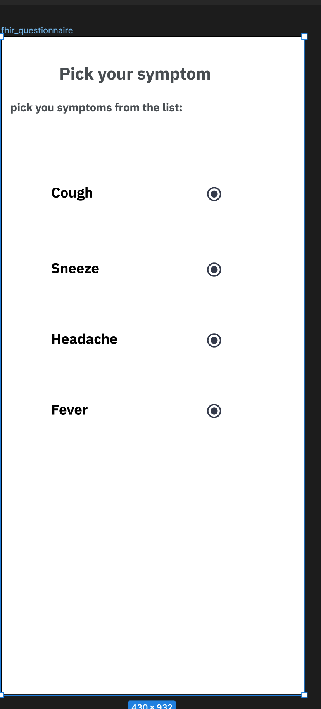
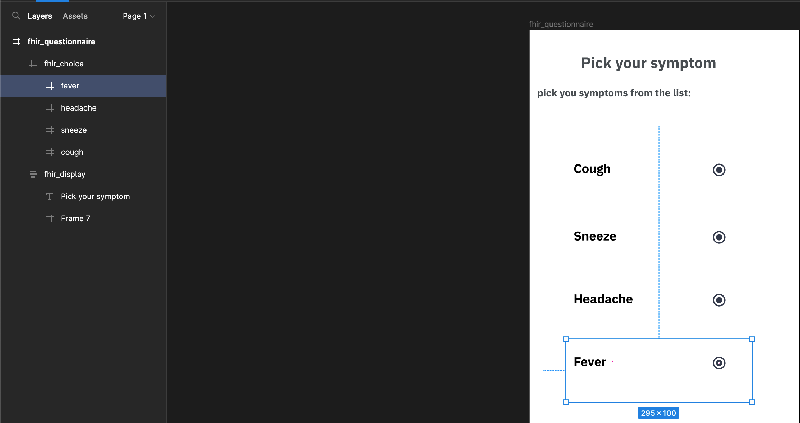

# FHIR Questionnaire Decision Engine Template

## Summary
This dockerized web-app will be used to deploy
code that will take in a series of FHIR Questionnaire
and once processed, consumer of the app can 
call into the app by sending a FHIR QuestionnaireResponse
and get next decision node

The decision engine template is completely dockerized.

## How to Run via docker
- Run `make docker-build` to build the container
- Run `make docker-run` to run the container which will expose the 8080 port

## Endpoints Examples

### POSTing a Questionnaire
```
curl --location --request POST 'localhost:8080/questionnaire' --header 'Content-Type: application/json' --data-raw '{
    "title": "covid screener",
    "resourceType": "Questionnaire",
    "language": "en-GB",
    "status": "draft",
    "publisher": "NHN",
    "meta": {
        "profile": [
            "http://ehelse.no/fhir/StructureDefinition/sdf-Questionnaire"
        ],
        "tag": [
            {
                "system": "urn:ietf:bcp:47",
                "code": "en-GB",
                "display": "English"
            }
        ]
    },
    "useContext": [
        {
            "code": {
                "system": "http://hl7.org/fhir/ValueSet/usage-context-type",
                "code": "focus",
                "display": "Clinical Focus"
            },
            "valueCodeableConcept": {
                "coding": [
                    {
                        "system": "urn:oid:2.16.578.1.12.4.1.1.8655",
                        "display": "covid screener"
                    }
                ]
            }
        }
    ],
    "contact": [
        {
            "name": "http://www.nhn.no"
        }
    ],
    "subjectType": [
        "Patient"
    ],
    "extension": [
        {
            "url": "http://helsenorge.no/fhir/StructureDefinition/sdf-sidebar",
            "valueCoding": {
                "system": "http://helsenorge.no/fhir/ValueSet/sdf-sidebar",
                "code": "1"
            }
        },
        {
            "url": "http://helsenorge.no/fhir/StructureDefinition/sdf-information-message",
            "valueCoding": {
                "system": "http://helsenorge.no/fhir/ValueSet/sdf-information-message",
                "code": "1"
            }
        }
    ],
    "id": "cvd-screener",
    "item": [
        {
            "linkId": "70250735-fbe3-4bcd-c0ad-a695c78fd40c",
            "type": "group",
            "text": "screener",
            "item": [
                {
                    "linkId": "3324c5f6-b4b2-4edb-f95b-54f157d194ad",
                    "type": "choice",
                    "text": "cough",
                    "required": false,
                    "answerOption": [
                        {
                            "valueCoding": {
                                "id": "508754d6-a911-4b20-f5c8-efe94af15b0b",
                                "code": "yes",
                                "system": "urn:uuid:147afa3f-4945-457d-8642-c4abe88cc9de",
                                "display": "yes"
                            }
                        },
                        {
                            "valueCoding": {
                                "id": "776dfbd4-63ba-4181-e51f-c5225dd1f75c",
                                "code": "no",
                                "system": "urn:uuid:147afa3f-4945-457d-8642-c4abe88cc9de",
                                "display": "no"
                            }
                        }
                    ],
                    "extension": [
                        {
                            "url": "http://hl7.org/fhir/StructureDefinition/questionnaire-itemControl",
                            "valueCodeableConcept": {
                                "coding": [
                                    {
                                        "system": "http://hl7.org/fhir/ValueSet/questionnaire-item-control",
                                        "code": "radio-button"
                                    }
                                ]
                            }
                        }
                    ]
                },
                {
                    "linkId": "3124808a-04f7-482f-831f-45d395084296",
                    "type": "choice",
                    "text": "sneeze",
                    "required": false,
                    "answerOption": [
                        {
                            "valueCoding": {
                                "id": "2efc6528-ef13-4944-f00b-92fdcfc81d63",
                                "code": "yes",
                                "system": "urn:uuid:88125d2f-0acb-4cad-8496-cbbb49038f3f",
                                "display": "yes"
                            }
                        },
                        {
                            "valueCoding": {
                                "id": "8c589c71-d2d6-4315-8f4a-cd87690ae5a7",
                                "code": "no",
                                "system": "urn:uuid:88125d2f-0acb-4cad-8496-cbbb49038f3f",
                                "display": "no"
                            }
                        }
                    ],
                    "enableWhen": [
                        {
                            "question": "3324c5f6-b4b2-4edb-f95b-54f157d194ad",
                            "operator": "exists",
                            "answerBoolean": true
                        }
                    ],
                    "extension": [
                        {
                            "url": "http://hl7.org/fhir/StructureDefinition/questionnaire-itemControl",
                            "valueCodeableConcept": {
                                "coding": [
                                    {
                                        "system": "http://hl7.org/fhir/ValueSet/questionnaire-item-control",
                                        "code": "radio-button"
                                    }
                                ]
                            }
                        }
                    ]
                }
            ],
            "required": false
        }
    ]
}'
```

### POSTing a QuestionnaireResponse with the list of QuestionnaireIds, we want to look at while making the decision
```
curl --location --request POST 'localhost:8080/questionnaire-resp' --header 'Content-Type: application/json' --data-raw '{
    "questionnaire_resp": {
        "resourceType": "QuestionnaireResponse",
        "id": "QR1",
        "status": "in-progress",
        "item": [
            {
                "linkId": "70250735-fbe3-4bcd-c0ad-a695c78fd40c",
                "text": "screener",
                "item": [
                    {
                        "linkId": "3324c5f6-b4b2-4edb-f95b-54f157d194ad",
                        "text": "cough",
                        "answer": [
                            {
                                "valueCoding": {
                                    "code": "yes",
                                    "display": "yes",
                                    "system": "urn:uuid:147afa3f-4945-457d-8642-c4abe88cc9de"
                                }
                            }
                        ]
                    },
                    {
                        "linkId": "3124808a-04f7-482f-831f-45d395084296",
                        "text": "sneeze",
                        "answer": [
                            {
                                "valueCoding": {
                                    "code": "no",
                                    "display": "no",
                                    "system": "urn:uuid:88125d2f-0acb-4cad-8496-cbbb49038f3f"
                                }
                            }
                        ]
                    }
                ]
            },
            {
                "linkId": "e9d474e2-0e99-44cd-875f-27a85e70d91c",
                "text": "Patient",
                "item": [
                    {
                        "linkId": "e1c623e9-0ea2-4bf2-9346-10fcdde28452",
                        "text": "age"
                    },
                    {
                        "linkId": "3110b365-998d-4590-8478-ba10acf82d58",
                        "text": "weight"
                    }
                ]
            },
            {
                "linkId": "5b4873a4-1226-495c-ecf9-f499053aafac",
                "text": "Oops\n"
            }
        ]
    },
    "q_ids": [
        "q1",
        "q2",
        "q3"
    ]
}'
```

## [Figma](https://www.figma.com/pricing/) -> FHIR Questionnaire (aka Fighir)
Users need an easy way to create a FHIR Questionnaire and one of the common tools used is Figma.
So what if we can create the form in Figma and then generate a FHIR Questionnaire using it 	🤔



That led me down this 🐇 hole.....
Hence `Fighir` was born.

### Figma REST apis
Figma APIs provide a way for extract a form extracted from the screen.
See https://www.figma.com/developers/api#intro for details.

See the [authentication](https://www.figma.com/developers/api#authentication) link to look into to oauth or personal access tokens for a workspace.

We can use the Figma files endpoint to extract all the elements drawn onto a screen.

The data extracted looks like a graph.

Once this graph is extracted from Figma, we can easily use DFS along with some processing to construct a FHIR Questionnaire.


### Endpoints
#### POST /fighir 
This endpoint accepts a Figma json graph and uses it to extract node and construct a FHIR Questionnaire which is returned using the json marshaller from Google.

See Postman for a sample body

### Design assumptions
 - If we want to include a multiple choice Frame from Figma, we need to name the Frame as `fhir_choice` AND each inner child frame should have the same name as the text element. See 


